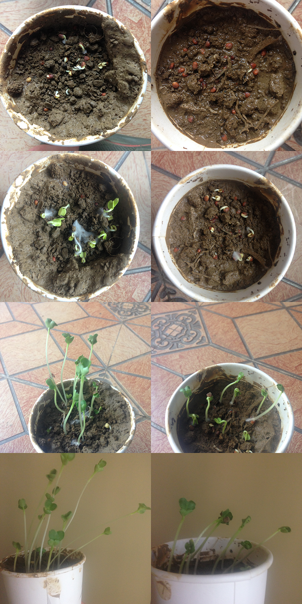

# 波卡西堆肥
波卡西堆肥，简单来说就是在一个堆肥桶里放上厨余和EM菌。既能减少垃圾，又能产生肥料。

## 原料
瓜果皮，菜梗，鸡蛋壳等厨余。骨头和剩菜里的汤汁不要放了，前者很难分解，后者包含过多的盐分和油分。把厨余切碎会更有利于分解，比如把西瓜皮切成小块，不过大部分情况下直接放就可以。

EM菌：这是一种能强烈分解有机物的菌，能抑制有害菌的生长，因此在发酵过程中没有臭味。将来可以在此基础上自制菌液（以后会加上制作菌液的方法，现在还没进行制作菌液的实验）

淘宝上一袋EM菌二十几块，可以用一年。如果会自制菌液，那还可以用久得多。[淘宝购买地址](https://item.taobao.com/item.htm?spm=a230r.1.14.33.b66d2d8bbv4KiU&id=36405284067&ns=1&abbucket=18#detail)

## 设备
堆肥桶：一个特殊的桶，首先它的底部有一个水龙头，用来排放发酵过程中产生的液肥。然后，有一个高于水龙头的位置加一个带滤网的隔层，防止液肥把正在发酵的厨余泡坏了，水分太大无法发酵；防止厨余把液肥吸收回去了，导致收集不到液肥。

## 使用方法
把每天产生厨余**及时**平铺桶里，然后在表面上撒上薄薄一层em菌，盖上盖子就行了。

## 肥料诞生
如果几天后长出白色的菌丝，那说明发酵过程良好。

主要是液肥，在发酵过程中就会有液肥产生，量还不小，发酵个一两周后，隔几天就要取一次。然后一比一百水稀释，浇叶子，一比十浇土，相当有肥效。

其次是固体肥，一般厨余夏天发酵三到四周，其它季节发酵六到七周就可以倒出来，埋到土里两周腐熟就可以用了，再和泥土以1:1混合搅拌沥干。

## 优点
1. 液肥的产生很快，在夏天一个星期你就能开始收获液肥了
2. 没有臭味，不招虫子
3. 不用天天倒垃圾了
4. 多出来的液肥可以给小区的植物补营养，也可以送朋友
5. 因为没有厨余垃圾了，家里的垃圾桶就不用套塑料袋了，因为其它的垃圾比如纸盒啊都是干燥的。

这是两杯实验萝卜苗，左边的加了液肥，效果显著
<h1 align="center">
  
</h1>

### Emmm...看起来好像不错？现在就开始你的波卡西堆肥之旅吧！
